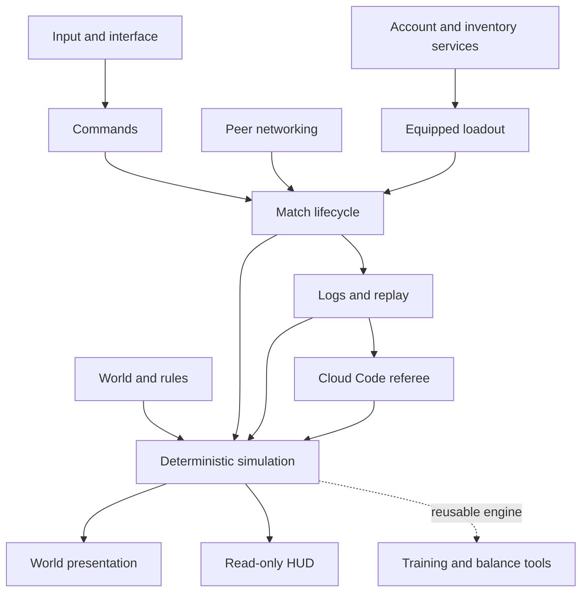

# Node War — codebase atlas

Node War is a 1v1 strategy game whose board is a graph, whose rules run in a deterministic C# simulation, and whose Unity client turns those rules into an interactive world. The backend adds persistent identity and inventory, and can replay a submitted match. Live matches still run on the two peers.

The central architectural investment is **one game, several ways to run and observe it**. A human, a scripted bot, and a replay supply commands to the same rules. Unity draws the results; a Cloud Code referee can compute them without Unity. Future training and balance tools can reuse that separation. Most of the design makes sense once these are understood as different clients of a shared game model.

This is a system-level design and onboarding guide, not an API reference. It explains ownership, data flow, tradeoffs, and extension points. Follow source links when you need implementation details. Descriptions are based on the backend implementation reviewed at `2e97d81c`; this is provenance, not a verification attestation. Unmerged branches are not described as implemented. Branch status and conflict analysis belong in PR review, not in this architecture guide.

## Read it as a book or explore it as a graph

Open the repository root as an Obsidian vault, then open this note. Opening the root keeps both documentation and source links inside the vault. No plugin or committed Obsidian settings are required: the chapters use ordinary relative Markdown links, headings, tags, and Mermaid. Obsidian's backlinks and local graph expose the connections; the same notes remain readable on GitHub. The diagram below also works as a map when Mermaid is unavailable: follow the chapter table.

| Chapter | The question it answers |
|---|---|
| [World and rules](world-and-rules.md) | What are the players deciding, and how do those decisions become data? |
| [Simulation](simulation.md) | Why is the game deterministic, and what must remain true? |
| [Match lifecycle](match-lifecycle.md) | How does a lobby selection become a running match and then a result? |
| [Input and interface](input-and-interface.md) | How do mouse, touch, bots, and UI express intent safely? |
| [World presentation](world-presentation.md) | How does a 10 Hz graph become a readable, responsive world? |
| [Networking](networking.md) | What crosses the wire, and how do peers agree? |
| [Backend and progression](backend-and-progression.md) | What belongs to the account and server rather than the match? |
| [Logs and replay](logs-and-replay.md) | How can the same game be reconstructed without rendering it? |
| [Engineering workflow](engineering-workflow.md) | Where does code live, how is it built, and what proves a change works? |
| [Decision map](decision-map.md) | Which architectural choices constrain several systems at once? |
| [Future extensions](future-extensions.md) | What do the existing seams enable, and what is still missing? |

For a first read, follow that order. For a gameplay task, start with world → simulation → workflow. For a UI task, start with lifecycle → interface → presentation. For backend work, read networking → backend → replay together: compatibility, ownership, and replay integrity solve different problems.

## Four kinds of truth

The word “state” hides important differences. A selected villager, an owned skin, and a villager's health are not owned by the same subsystem.

| Kind of truth | Owner | Lifetime | Example |
|---|---|---|---|
| Match outcome and rules | `SimulationState` plus configured rule data | One match | Health, resources, path progress, district era |
| Player intent and presentation | Input/UI/View and their coordinators | Gesture, screen, or match | Selection, camera POV, open sheet, interpolation |
| Persistent account progression | Backend records and server rules | Across matches and devices | Owned variants, equipped skin, rating record |
| Local preferences and transitional profile data | `PlayerProfile` | Across local sessions | Settings, selected loadout, remembered Workshop tab |

The profile has older progression-shaped fields too. Their existence does not grant them authority over backend inventory or make result reporting complete. See [backend migration boundaries](backend-and-progression.md#local-profile-and-server-records-coexist).

Authority also has two meanings here. **Gameplay authority** is currently replicated peer execution. **Persistent-data authority** is server-side for protected records. A replay referee is a bridge toward stronger result validation, but a consistent log alone does not prove that two authenticated people played it.

## Three walkthroughs that connect the chapters

**Move a villager.** The gesture system resolves a pointer action; selection identifies the controlled villager; `CommandSystem` queues a `Move`; the tick driver applies commands in its canonical order; `CommandProcessor` validates the order; movement advances in simulation ticks; the view interpolates the new state. In a networked game the command is delayed and exchanged before execution. The recorder captures the applied command, so replay follows the same route later. See [input](input-and-interface.md), [networking](networking.md), and [replay](logs-and-replay.md).

**Equip an era in the Workshop.** The UI asks an inventory service; shared/server rules validate ownership, base identity, and arena usability; the returned `PlayerState` updates the display and remembered state. At launch, `LoadoutTypes` maps lobby IDs and equipped catalog items into per-type era tables and skin IDs. Draft exchange carries them to the peer. `MatchFactory` gives gameplay eras to the simulation; skins stay outside it. See [backend](backend-and-progression.md) and [lifecycle](match-lifecycle.md).

**Finish and reconstruct a match.** A breach changes simulation state; the win-check ends play; UI and effects observe it; the recorder seals commands, checkpoints, and result into a local `.nwml` file. A referee can select the matching exported balance, build tick zero, and replay to compare hashes and winner. Automated upload, authenticated reporting, and rating settlement are separate work. See [logs and replay](logs-and-replay.md).

## How this guide relates to the existing docs

[Architecture](../architecture.md) remains the detailed layer and class reference; [game model](../game-model.md) owns gameplay vocabulary; [simulation rules](../simulation-rules.md) is the mandatory determinism contract. This atlas supplies a connected explanation across those references. [Direction](../direction.md) records design direction and can contain older proposals; [future extensions](future-extensions.md) distinguishes those proposals from their implemented foundations.

Code defines current behavior. Notion owns planned and active work. The historical design document is background, not a competing specification. Maintain links and ownership explanations here when code moves; do not turn this guide into a second task tracker or silently mark its frontmatter verified.
