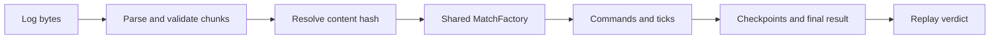

# Logs, replay, and the referee

[Atlas](README.md) · Previous: [Backend and progression](backend-and-progression.md) · Next: [Engineering workflow](engineering-workflow.md)

A deterministic game does not need a video or a snapshot of every frame to reproduce a match. It needs the starting configuration, ordered inputs, compatible rules, and enough evidence to check the result. The match-log library packages those ingredients independently of Unity.

## Record the commands that actually ran

Both tick drivers expose applied-command and hash events for recording. Commands are captured in execution order rather than the order a UI button happened to enqueue them. In lockstep, that means player 0's commands followed by player 1's. The recorder also collects periodic checkpoints and final result metadata.

Command tick numbers describe the state before the tick advances. Checkpoint numbers describe state after advancement. Empty-command ticks can be implicit because the replay still advances to the declared end tick. This convention must remain shared between runners and replay.

Normal drafted matches start recording after their board/loadout/placement data is available. The legacy skip-draft testing board is excluded. `LocalMatchLogStore` writes completed `.nwml` files beneath the application's persistent data directory and retains the newest twenty. A disk-write failure loses a log and reports a warning rather than throwing through match completion.

This is local evidence storage. There is no automatic server result upload or replay-history service implied by these files.

## A versioned container with explicit meaning

The binary format begins with magic and a format version, then length-prefixed tagged chunks. Unknown tags can be skipped; malformed known payloads are refused. A known tag's meaning is stable, so changing a payload requires deliberate format evolution rather than silently repurposing fields.

| Chunk | Why replay needs it |
|---|---|
| HEADER | Protocol/simulation/content identity and match metadata |
| BOARD | Board configuration used to construct the graph |
| LOADOUTS | Each player's resolved gameplay choices |
| DRAFT | The ordered placements that define the starting board |
| TICKS | Applied gameplay commands |
| HASHES | Intermediate state fingerprints |
| RESULT | End tick, reason, winner/result evidence, final hash |
| ERAS | Per-player suit and district era tables |
| SKINS | Cosmetic equipment retained for future presentation |

Container extensibility is not semantic compatibility. Skipping an unknown cosmetic chunk may be safe; ignoring a future rules-bearing chunk could reconstruct a different game. Protocol/simulation identity and reader validation must still establish that a log is suitable for this engine.

## Rebuild, execute, compare

`MatchReplay` checks compatibility and ordering, calls `MatchFactory.Configure` and `Build`, then advances the same command processor and simulation used live. It compares logged checkpoints and the final state/result. A log that continues ticking after the game already ended is rejected. A first mismatch tick helps narrow investigation.

`Referee` wraps this in Cloud Code. `BalanceCatalog` selects an embedded server balance by the log's content hash; unknown balances are refused. Editor export writes balances by hash, so a shipped balance and its corresponding server export form one operational release unit. Keeping an old exported balance does not provide an old simulation implementation: replay also checks simulation version.

The referee bounds log size and replay tick count, reports a verdict, and serializes replay execution behind a process-wide lock. The lock protects mutable simulation configuration. It is not an account lock, a rate limiter, or protection against replaying the same ranked result twice. The current implementation's limits are code choices, not a claim about today's cloud-provider quotas.

## What a green verdict proves

It proves that the supplied transcript can be executed under the selected rules and reaches the logged checkpoints and result. It does not prove authenticated player participation, signed command origin, ownership of the logged eras, a server-issued match identity, or that a result has not already been rewarded.

That distinction is essential: a fabricated command stream can be entirely consistent. `VerifyMatch` is a useful replay/referee foundation, but it must not be promoted directly into a ranked settlement endpoint. [Backend reporting](future-extensions.md#trusted-results-before-ranked-settlement) must establish those additional facts.

## Several future tools share this engine

A replay viewer can attach presentation to reconstructed state. Seeking will need checkpoints or snapshots with a complete state contract, not merely remembering current positions. A desync investigator can compare a failing log with the pinned rules and configuration. A balance rig can feed generated commands into the same factory and tick loop. A training environment can expose reset/step around them.

These applications share the rule engine, but need different surrounding controls. Replay follows recorded commands; training generates new actions and observations; a viewer manages playback speed and camera state. Do not make visualization speed become simulation frame time, or assume the scripted Unity-side bot is already a standalone training process. See [future extensions](future-extensions.md).

## Source landmarks

[MatchLogFormat.cs](../../Assets/Scripts/MatchLog/MatchLogFormat.cs) | [MatchRecorder.cs](../../Assets/Scripts/MatchLog/MatchRecorder.cs) | [MatchReplay.cs](../../Assets/Scripts/MatchLog/MatchReplay.cs) | [LocalMatchLogStore.cs](../../Assets/Scripts/Backend/LocalMatchLogStore.cs) | [Referee.cs](../../dotnet/NodeWarCloud/NodeWarCloud/Referee.cs) | [BalanceCatalog.cs](../../dotnet/NodeWarCloud/NodeWarCloud/BalanceCatalog.cs)
