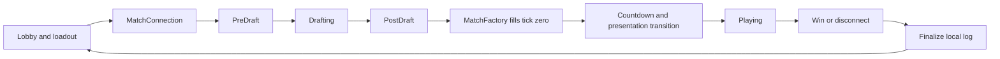

# Match lifecycle

[Atlas](README.md) · Previous: [Simulation](simulation.md) · Next: [Input and interface](input-and-interface.md)

`GameManager` is the composition root for a match. It connects rule data, simulation state, input, tick driving, camera, views, and presenters. It owns when those systems exist and run; it should not become a second home for gameplay rules.

## Across the scene boundary

The main flow is Lobby → Gameplay → Lobby. A separate GFX Testing scene supports visual experiments. The lobby does not run a match simulation. It collects identity, local preferences, loadout choices, and connection information.

`MatchLauncher` prepares local/bot or networked play. Equipped server state is translated onto the selected loadout through `LoadoutTypes.WithEquipment`. `MatchConnection` carries the resulting launch context across the scene load: connection ownership, local player ID, mode, and loadout. `PlayerProfile` survives scenes separately because preferences and local selections have a longer lifetime than one match.

`SceneTransition` owns the temporary covering sheet while scenes load asynchronously. It blocks interaction during the visual transition but does not suspend the network or turn presentation delay into simulation time. Its persistent root is temporary; it is not another account or match singleton.

## Draft is its own protocol and interaction phase

`DraftManager` coordinates ready/loadout exchange, turn order, placements, acknowledgements, and completion. `DraftState` represents draft occupancy and choices. This is not yet a populated, ticking gameplay board, even though `GameManager` may already hold the state object that other systems will later observe.

`IDraftPresenter` separates the draft's turn machine from its display. UI Toolkit and uGUI presenters can express the same phase without making the draft rules know about panels or prefabs. This interface matters because draft placement spans UI cards and a world-space board; it cannot be reduced to a passive label view.

At completion, the manager captures both loadouts before destroying the draft manager, retains the placement result, and constructs the gameplay board. Draft ghosts and placed-piece objects may outlive the draft presenter long enough to participate in the transition; their cleanup belongs to that lifetime, not an arbitrary frame delay.

## One starting board, three consumers

`MatchFactory` is shared by normal live drafted matches, headless replay, and the referee through replay. It creates nodes and edges, applies fixed and drafted placements, establishes players and Cores, and assigns the starting villagers stable IDs. `PlayerSetup` contains simulation types and era tables; lobby strings have already been resolved outside this boundary.

`Fill` initializes an existing state object for the live manager. `Build` returns one for a headless caller. Both use the same construction logic. Sharing the object in the live path matters because input and presentation may already hold references to it; replacing it casually can strand consumers on an obsolete world.

There remains a legacy skip-draft test path. It builds its special node layout separately, while reusing player and villager initialization. Its hardcoded board is not represented by the normal recorded BOARD/DRAFT pair, so it is deliberately not recorded. Do not use that path as evidence that a normal drafted match or replay initializes correctly.

This shared factory is the reason a setup refactor is a rules change. Altering node IDs, edge order, starting population, or placement eras can invalidate honest replays even if later tick logic is untouched.

## Choose a clock, then let consumers observe it

Local play uses `TickRunner`; networked play uses `LockstepRunner`. Both expose `ITickProvider`, which supplies the shared observation seam for state progress, presentation timing, and per-tick notifications. Bots generate commands in the local path rather than calling rule helpers to get privileged outcomes.

The gameplay runner starts paused while the countdown/transition finishes. Unpausing establishes the timing baseline for active play. A visual transition must not accidentally consume a network timeout budget or produce a burst of gameplay ticks accumulated before the match began.

After setup, the manager spawns node and villager views, connects selection and camera POV, binds the chosen HUD, and installs consumers such as indicator and shake directors. During play it also notices population growth so new villagers receive views. These are coordination responsibilities around the simulation, not mutations of gameplay state.

## Completion and cleanup are architectural work

A win and a disconnect are different endings. The UI displays the appropriate outcome; recording finishes with an end reason and state fingerprint. The local log is saved independently of future server reporting. Returning to the lobby shuts down the match connection rather than leaving a transport from the previous match alive.

Event subscriptions and static presentation caches deserve the same attention as GameObjects. Several systems reset statics on entering Play Mode because Unity can skip domain reload. Without those resets, a second Editor run can inherit a completed task, singleton, or camera-facing cache from the first.

When diagnosing a lifecycle bug, identify the phase and owner first: launch context, draft protocol, tick-zero construction, paused runner, active loop, or teardown. Testing only the middle of a match misses the transitions where most ownership changes happen. See [engineering workflow](engineering-workflow.md) for what automated checks cannot prove.

## Source landmarks

[GameManager.cs](../../Assets/Scripts/Game/Core/GameManager.cs) | [DraftManager.cs](../../Assets/Scripts/Game/Core/DraftManager.cs) | [MatchLauncher.cs](../../Assets/UI/Scripts/MatchLauncher.cs) | [MatchFactory.cs](../../Assets/Scripts/Game/Simulation/MatchFactory.cs) | [MatchConnection.cs](../../Assets/Scripts/Game/Core/MatchConnection.cs)
