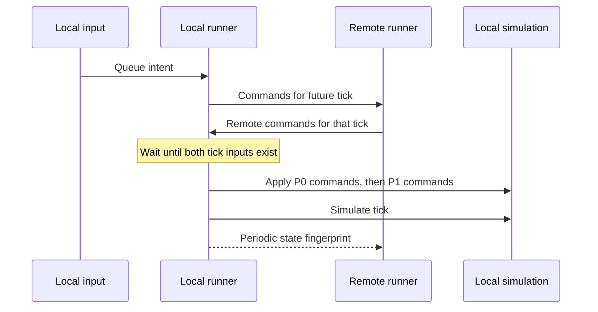

# Peer networking and compatibility

[Atlas](README.md) · Previous: [World presentation](world-presentation.md) · Next: [Backend and progression](backend-and-progression.md)

The live match exchanges inputs and runs the game on both peers. It does not stream authoritative positions from a dedicated simulation server. That choice keeps gameplay hosting small and makes the deterministic [simulation](simulation.md) the central networking dependency.

## Transport moves bytes; lockstep gives them meaning

`NetworkManager` wraps connection and packet transport, including direct and Relay-backed paths. Relay is connectivity infrastructure, not a gameplay referee. `InputSerializer` defines the gameplay/handshake packet layouts and `DraftSerializer` covers draft-specific exchange.

`LockstepRunner` collects local intent, sends tick inputs, stores remote inputs, and waits until both inputs for a tick exist. Empty input still matters: it says the other player had no command for that tick, rather than that their packet has not arrived. Commands are applied for player 0 first, then player 1, before simulating. Network arrival order must never decide whose command wins a same-tick interaction.

The current runner stamps local commands two ticks ahead at a nominal ten ticks per second. This trades input latency for a window in which packets can arrive. It stalls when required data is absent rather than guessing and correcting later. There is no general rollback/prediction implementation to assume when building a new interaction.

## Connection health is outside gameplay time

Heartbeat, resend, accumulator limits, and disconnect timers belong to the runner/transport layer. They use real time because they answer whether communication is alive, not how much food a worker produced. Draft readiness and retries have their own pre-match lifecycle.

The distinction matters when a loading sheet, countdown, or long frame occurs. Presentation can block user input, but must not silently stop servicing the network. Conversely, accumulated wall-clock delay must not let one peer simulate without its partner's commands. The runner's catch-up limits keep stalled frames from becoming an uncontrolled burst.

A malformed packet, lost connection, or incompatible build is a networking failure path. It is not a normal gameplay command or a substitute for authenticated result settlement. Manual two-peer testing remains necessary for these transitions even when wire-format unit tests pass.

## Refuse incompatible peers before drafting

`BuildIdentity` combines protocol version, simulation version, and balance content hash. `LocalBuildIdentity` derives it from the build and shared Resources balance. The lobby handshake compares identities and refuses mismatches before investing in a match that cannot stay synchronized.

Protocol changes include loadout wire changes: eras and skins must be interpreted consistently even though only eras affect rules. Simulation version changes describe semantic differences for the same inputs. Balance hashing captures tuned content independently from code semantics. A new packet field should not be smuggled into an old layout because its default happens to work locally.

The shared balance's resource identity is important. Moving or tuning it requires preserving its Unity references and updating the server's exported content. Two clients agreeing with each other is insufficient if the referee cannot resolve their balance hash later. See [logs and replay](logs-and-replay.md).

## Detect divergence without pretending to explain it

Every fifty ticks the runner computes a state fingerprint and compares matching checkpoints. A mismatch identifies a point by which the simulations diverged; it does not locate the first bad command or automatically repair state. The command stream, configuration, and [replay](logs-and-replay.md) are the evidence needed to investigate.

Hash tick labels must be interpreted carefully: commands are recorded with the pre-tick count, while checkpoint hashes observe post-tick state. A one-tick indexing error in tooling can look like a deterministic rules bug. Keep the same convention as runner recording events and replay.

## Social signals and gameplay inputs are separate

Emotes use their own packet and `IEmoteChannel` path. Sequence handling, duplicate suppression, rate limiting, and mute behavior are presentation/social concerns. An emote cannot alter simulation state and need not occupy a gameplay command slot or change a deterministic baseline.

This is a useful model for future features: first decide whether a message can affect an outcome. If it can, it belongs in the reproducible command/configuration path. If it only changes appearance, keep it out of match state and clearly define its delivery expectations.

## Determinism does not establish honesty

Both peers computing the same result is a consistency property. A client can still fabricate a complete self-consistent transcript. The current replay referee does not provide signed commands, trusted match sessions, or loadout-ownership proof. Those belong to [backend result reporting](future-extensions.md#trusted-results-before-ranked-settlement).

Future authoritative simulation could replace who advances the live game while reusing the rules library. It would still need transport, identity, operational limits, and a client synchronization design. Preserving the current boundary creates that option; it does not make the hosting migration already implemented.

## Source landmarks

[LockstepRunner.cs](../../Assets/Scripts/Game/Network/LockstepRunner.cs) | [NetworkManager.cs](../../Assets/Scripts/Game/Network/NetworkManager.cs) | [InputSerializer.cs](../../Assets/Scripts/Game/Network/InputSerializer.cs) | [DraftSerializer.cs](../../Assets/Scripts/Game/Network/DraftSerializer.cs) | [LocalBuildIdentity.cs](../../Assets/Scripts/Game/Network/LocalBuildIdentity.cs)
